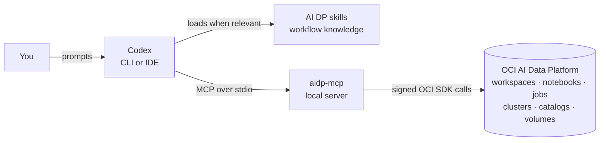

# Codex for OCI AI Data Platform


**Develop on your laptop with Codex. Deploy and run on OCI AI Data Platform
with guardrails.**

`codex-4-oci-aidp` connects a coding agent to
[Oracle AI Data Platform](https://docs.oracle.com/en/cloud/paas/ai-data-platform/)
(AI DP). You write notebooks, and soon LangGraph agents, locally. Then you ask
Codex to explore the platform, deploy your work, and run it. Codex does this
through a local MCP server that plans every change before making it and never
mutates remote resources without your explicit confirmation.




## Why

AI DP is the execution platform. Your laptop is where development is
fastest. Coding agents are good at writing code, but they know little about
AI DP. Letting an agent call cloud APIs freely is also risky. This project
closes that gap with two complementary pieces:

* **Tools with guarantees:** the MCP server exposes a small set of typed AI
  DP operations. Safety lives in code, not in prompts:
  * plan by default (`apply=false`);
  * explicit confirmation flags for anything that costs money or changes
    state;
  * exact resource names;
  * bounded outputs;
  * no credentials or file contents in responses.
* **Skills with know-how:** Codex skills describe *how* to combine the tools:
  * in which order to call them;
  * when to stop and ask you;
  * which mistakes to avoid.

  Codex loads a skill only when your request needs it.

The repository is also an evaluation of how far Codex can help configure and
develop on AI DP. Specifications record what was automated, what needed a
human, and what was verified on the real platform.

## What you can do today

Ask Codex, in plain language, for example:

* *"List the external volumes in catalog `sales` and show me the files under
  `/raw`."*
* *"Deploy `notebooks/etl.ipynb` to AI DP and run it on cluster `dev-cluster`."*
* *"Is my cluster running? If not, tell me what starting it implies."*
* *"Show me the last runs of job `etl-nightly` and the output of the failed
  one."*

| Capability | How |
| --- | --- |
| Explore notebooks, jobs, clusters, catalogs, and volumes | 12 MCP tools, read-only by default, listed in [aidp_mcp](aidp_mcp/README.md) |
| Upload a local notebook to a workspace | `upload_notebook`: plan first, then apply after your confirmation |
| Create and run a managed notebook job | `ensure_notebook_job` and `start_notebook_job`, with explicit confirmation |
| Start or stop a cluster | `set_cluster_state`, with explicit confirmation and a cost warning |
| Follow a deploy-and-run workflow end to end | the [`aidp-notebook-deploy-and-run`](skills/aidp-notebook-deploy-and-run/SKILL.md) skill |

## Roadmap

| Status | Item |
| --- | --- |
| ✅ Done | Guarded MCP server, installable and usable from any project |
| ✅ Done | Skills infrastructure and the first operational skill |
| 🔜 Next | Experiment: deploy a code-first LangGraph agent to AI DP AI Compute |
| 🔜 Next | Agent tools in the MCP server: upload code, deploy, invoke, traces |
| 🔜 Next | Agent authoring and deployment skills, based on verified facts |

## Quick start

Prerequisites:

* macOS or Linux with Conda;
* an OCI API-key profile in `~/.oci/config`;
* an AI DP instance and workspace you are allowed to use;
* Codex (CLI or IDE extension).

**1. Install** into the project Conda environment. Oracle distributes the
AI DP SDK as a wheel inside a release ZIP; verify its checksum:

```bash
conda activate codex-4-oci-aidp
mkdir -p .deps
curl -fL 'https://github.com/oracle-samples/aidataplatform-sdk/releases/download/v4.2.1/aidp-python-client-4.2.1.zip' \
  -o .deps/aidp-python-client-4.2.1.zip
echo '9cd99a1196b89e9a3354f8b9111ce59412efb23c4888e56126e3a2ca2364c3ba  .deps/aidp-python-client-4.2.1.zip' | shasum -a 256 -c -
unzip -o .deps/aidp-python-client-4.2.1.zip '*.whl' -d .deps
python -m pip install -r requirements-dev.txt
python -m pip install --no-deps --no-build-isolation -e .
```

Only the editable installation is supported; see
[aidp_mcp](aidp_mcp/README.md) for the reasons.

**2. Configure** your target. Copy [.env.example](.env.example) to `.env` and
set at least `REGION`, `OCI_PROFILE`, `COMPARTMENT` (an OCID is fastest),
`AIDP_INSTANCE_ID`, and `WORKSPACE_NAME`. The file holds identifiers only,
never keys. To use notebooks from other projects, list their folders in
`AIDP_ALLOWED_ROOTS`.

**3. Register the MCP server** in `~/.codex/config.toml`, with the absolute
path of the installed command:

```toml
[mcp_servers.aidp-mcp]
command = "/absolute/path/to/conda/envs/codex-4-oci-aidp/bin/aidp-mcp"
```

**4. Install the skills** at user scope, so they are available in every
project:

```bash
scripts/install_skills.sh
```

**5. Start a new Codex session** in any project and ask: *"Which AI DP tools
do you have?"*

Details, alternatives such as `AIDP_ENV_FILE` for several environments, and
troubleshooting are in the [MCP server guide](aidp_mcp/README.md) and the
[skills guide](skills/README.md).

## Documentation

| Topic | Where |
| --- | --- |
| MCP server: tools, configuration, registration, code layout | [aidp_mcp/README.md](aidp_mcp/README.md) |
| Skills: classes, installation, update, removal | [skills/README.md](skills/README.md) |
| Design decisions, acceptance criteria, verification evidence | [specs/](specs/) |
| Contributor checks (Black, Pylint, pytest) | [DEVELOPMENT.md](DEVELOPMENT.md) |
| Rules for coding agents working on this repository | [AGENTS.md](AGENTS.md) |
| Changes | [CHANGELOG.md](CHANGELOG.md) |

Command-line utilities that share the same configuration:

* [Cluster lifecycle](cluster_lifecycle/README.md): inspect, start, and stop a
  Workbench cluster.
* [Catalog tree](catalog_tree/README.md): print a catalog's schemas and
  volumes as a tree.

Both reuse [aidp_common](aidp_common/README.md) for authentication, settings,
SDK initialization, and resource discovery.

## Repository layout

```text
aidp_mcp/        MCP server: server.py adapter, domain modules, shared modules
aidp_common/     Shared OCI authentication, settings, and discovery
skills/          Operational AI DP skills (installed at user scope)
.agents/skills/  Skills for developing this repository
specs/           Specifications and verification evidence
scripts/         Launchers and the skills installer
cluster_lifecycle/, catalog_tree/   Command-line utilities
notebooks/       Example notebooks
```

## Dependencies

| Package | Version | Purpose |
| --- | --- | --- |
| [Oracle AI DP SDK](https://github.com/oracle-samples/aidataplatform-sdk) (`aidp-python-client`) | 4.2.1 | Typed clients for AI DP workspaces, notebooks, jobs, clusters, catalogs, and volumes |
| `oci` | 2.165.1 | OCI configuration, request signing, and instance discovery (required range for SDK 4.2.1: `>=2.165.0,<2.166`) |
| `fastmcp` | 3.4.5 | Local stdio MCP server |
| `python-dotenv` | 1.2.3 | Shared `.env` settings |

Development tools (Black, Pylint, pytest) are pinned in
[requirements-dev.txt](requirements-dev.txt). No OCI CLI installation is
needed.

## Security model

* The server runs locally over stdio. It opens no network port and contacts
  OCI only when a tool needs it.
* Credentials stay in your OCI configuration. `.env` holds identifiers only
  and is excluded from Git.
* Mutations require explicit flags that the model must set, and the skills
  require your approval in the conversation before each one.
* Local uploads are limited to operator-configured folders. The model cannot
  widen them.

## License

[MIT](LICENSE)
